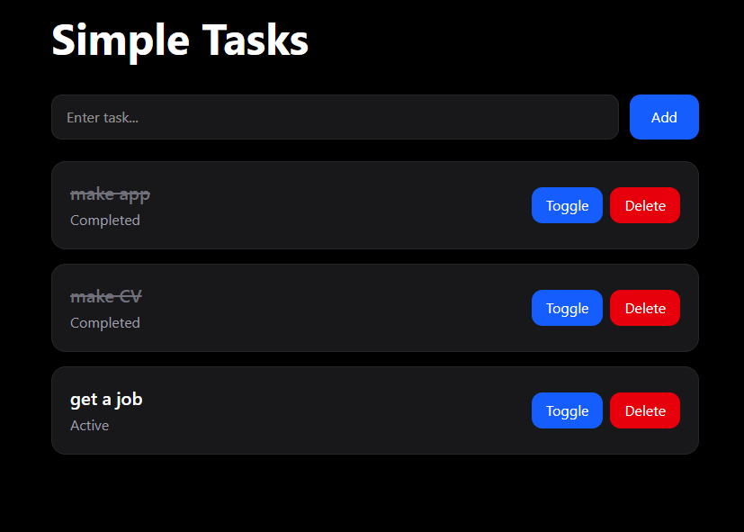

# Simple Tasks

A simple full-stack task management application built with React and ASP.NET Core Web API.

## Screenshot

## Features

- Create tasks
- View tasks
- Mark tasks as completed
- Delete tasks
- RESTful API
- Docker support
- Basic API tests

---

## Tech Stack

### Frontend
- React
- Axios
- Tailwind CSS
- Vite

### Backend
- ASP.NET Core Web API
- C#

### Testing
- xUnit

### DevOps
- Docker
- Docker Compose

---

## API Endpoints

### Get all tasks

## Deployment

### Clone the repository 

'''bash
git clone https://github.com/your-username/simple-tasks.git cd simple-tasks

### Run with Docker

docker compose up --build

### he application will be available at:

### Frontend:
http://localhost:5173

